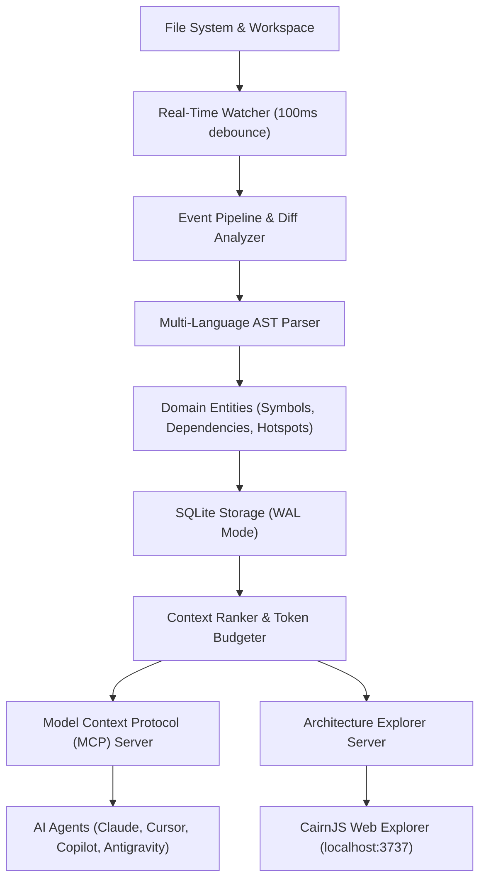

# CodeMemory Architecture & System Design

## 1. Overview

**CodeMemory** is a local-first, persistent engineering context layer and AST memory system for AI coding assistants. It watches your workspace, indexes code symbols, caller graphs, and file histories directly into local SQLite memory, and exposes high-precision context slices via standard Model Context Protocol (MCP) transports.

---

## 2. Core Modules & Component Separation

```
src/
├── cli.ts            # Commander CLI router and subcommand dispatch
├── types/            # Strict TypeScript domain interfaces and contracts
├── db/               # SQLite WAL database layer, schema migrations, and queries
├── parser/           # Multi-language AST regex/symbol extractor (TS, JS, Py, Rust, Go, SQL, C++)
├── watcher/          # Debounced Chokidar file event watcher with .gitignore compliance
├── context/          # Relevance ranking engine and token budget calculator
├── mcp/              # Model Context Protocol stdio and unified transport server
├── plugins/          # Extensible plugin lifecycle manager and manifest validator
├── skills/           # SKILLS.md, AGENTS.md, and convention extractor
└── web/              # Embedded HTTP server and SSE live watcher stream
```

---

## 3. Data Flow Architecture



---

## 4. Key Architectural Decisions

1. **SQLite in WAL Mode**:
   - Write-Ahead Logging (`PRAGMA journal_mode = WAL;`) allows concurrent zero-blocking reads across multiple IDE processes while serializing atomic writes.
2. **Deterministic Token Budgeting**:
   - Instead of flooding LLM prompts with whole files, the context ranker slices only task-relevant symbols, callers, and recent diffs within a strict user-defined token budget (e.g. 2,000–4,000 tokens).
3. **Local-First & Zero Telemetry**:
   - 100% of symbol tables, call graphs, and historical change logs remain strictly on local disk (`.codememory/codememory.db`). Zero network egress, zero third-party cloud data transmission.
4. **Sub-100ms Incremental Watcher**:
   - File changes are processed incrementally. Only modified files are re-parsed and re-indexed.
5. **Universal Protocol Gateway**:
   - Native Model Context Protocol (MCP) support over stdio provides instant compatibility with Cursor AI, VS Code Copilot, Claude Desktop, Google Antigravity, and autonomous agent sidecars.
