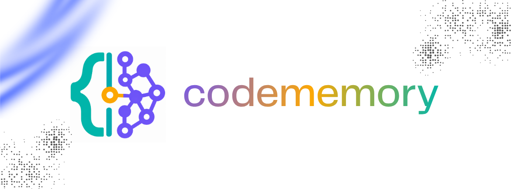

# 🧠 CodeMemory

**The Persistent Intelligence Layer for Codebases**  
*Local-first, privacy-obsessed CLI tool and Model Context Protocol (MCP) server for AI agents.*

🌐 **Official Website & Docs**: [https://codemem.vercel.app/](https://codemem.vercel.app/)

---

## ⚡ Key Highlights

- 🔒 **100% Local & Private**: Zero telemetry, zero external network calls. All intelligence stored locally in SQLite WAL mode.
- 🌐 **Interactive Web Architecture Explorer**: Local visual flowchart & memory dashboard with timeline scrubbing and real-time live updates.
- ⚡ **Token Efficiency**: Minimizes AI prompt token consumption by providing targeted context slices and caller graphs instead of raw file dumps.
- 🔍 **Multi-Language AST Analysis**: Extracts functions, classes, interfaces, structs, and imports across TypeScript/JavaScript, Python, Rust, Go, SQL, and more.
- 👀 **Real-time Live Watcher**: Detects code changes instantly with 100ms debouncing and `.gitignore` integration.
- 🤖 **Native MCP Server**: Ready to connect with Antigravity, Claude Desktop, Cursor, Copilot, and custom AI agents.
- 📊 **Architecture Visualizer**: Generates live Mermaid diagrams, Markdown documentation, and JSON maps.

---

## 🚀 Quick Start

### 1. Installation

```bash
# Clone the repository
git clone https://github.com/EldrexDelosReyesBula/CodeMemory.git
cd CodeMemory

# Install dependencies
npm install

# Build TypeScript
npm run build
```

### 2. Basic Commands

```bash
# Initialize CodeMemory in your repository
npm run dev -- init

# Scan the current codebase and index all symbols
npm run dev -- scan

# Search for any function, class, or symbol
npm run dev -- query authenticateUser

# Extract token-budgeted AI context
npm run dev -- context AuthService --budget 2000

# Start the live background file watcher
npm run dev -- watch

# Export Mermaid architecture diagram
npm run dev -- export --format mermaid

# Check repository health and statistics
npm run dev -- status
```

---

## 🤖 Connecting to AI Agents via MCP

CodeMemory provides a full Model Context Protocol (MCP) stdio server.

### Available MCP Tools

| Tool | Description |
| :--- | :--- |
| `codememory_search` | Search code symbols, signatures, and functions |
| `codememory_get_context` | Token-budgeted context with dependencies & callers |
| `codememory_get_dependencies` | Upstream imports and downstream dependents |
| `codememory_get_history` | Recent file modifications and Git commit logs |
| `codememory_get_architecture` | Generate real-time Mermaid architecture diagrams |
| `codememory_get_metrics` | Overall codebase stats and language breakdowns |

### Antigravity & Claude Desktop Configuration

Add the following to your MCP configuration (`mcp_config.json` or `claude_desktop_config.json`):

```json
{
  "mcpServers": {
    "codememory": {
      "command": "node",
      "args": ["c:/Users/Eldrex/Downloads/classhost/Needs/CodeMemory/dist/cli.js", "mcp"],
      "env": {}
    }
  }
}
```

---

## 🏗️ Architecture

```
CodeMemory/
├── src/
│   ├── types/          # Domain data types & contracts
│   ├── db/             # SQLite engine with WAL mode & indexes
│   ├── parser/         # Multi-language AST symbol & dependency extractor
│   ├── watcher/        # Real-time debounced file watcher with .gitignore
│   ├── git/            # Git commit and diff history monitor
│   ├── generator/      # Mermaid diagram & Markdown/JSON exporters
│   ├── context/        # Token-budgeted context assembly & symbol ranker
│   ├── mcp/            # Model Context Protocol stdio server
│   └── cli.ts          # CLI commands router
└── tests/              # Complete Vitest test suite
```

---

## 📜 License

MIT License - Copyright (c) 2026 Eldrex Delos Reyes Bula.
