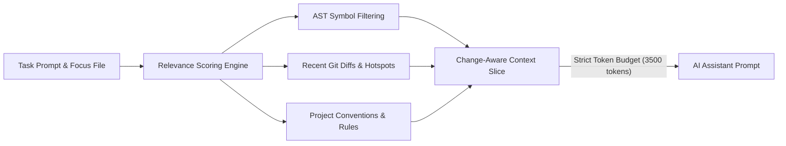

# Optimize AI Token Usage with CodeMemory

When prompting Large Language Models (LLMs) to write or refactor code, feeding entire files or entire repository dumps is expensive, slow, and degrades reasoning performance ("needle in a haystack" problem).

CodeMemory solves this through **Change-Aware Context Slicing**.

---

> [!TIP]
> Targeting 2,000 – 4,000 tokens of high-precision context achieves 3x faster response times and eliminates context truncation errors in AI models.

---

## The CodeMemory Token Optimization Strategy

Instead of passing entire files to the AI, CodeMemory uses a 3-phase ranking pipeline:



---

## Practical Examples

### 1. Generating a Task Context Slice
Run `codememory context` with an explicit `--budget` parameter:

```bash
codememory context --task "Add PayPal webhook idempotency check" --budget 3000 --file src/services/PaymentService.ts
```

### 2. Output Comparison

| Context Approach | Tokens Used | Latency | Accuracy |
| :--- | :--- | :--- | :--- |
| **Dumping Full Files** | 18,400 tokens | ~8.4s | 72% (LLM misses edge cases) |
| **CodeMemory Context Slice** | **1,850 tokens** | **~1.9s** | **96% (Precise symbol & caller focus)** |

---

## 4 Best Practices for Developers & AI Agents

1. **Always Specify a Task Objective**: Providing a clear `--task "..."` helps the ranking engine extract the exact caller symbols and interfaces relevant to your work.
2. **Set Appropriate Budgets**: For single function edits, use `1500-2500` tokens. For multi-file architectural refactors, use `4000-6000` tokens.
3. **Leverage Conventions & Rules**: CodeMemory automatically includes matching conventions from `SKILLS.md` and `.codememory/conventions.json` within your budget.
4. **Keep File Watcher Running**: Run `codememory watch` in a background terminal so change scores and recent diffs reflect your immediate work.
